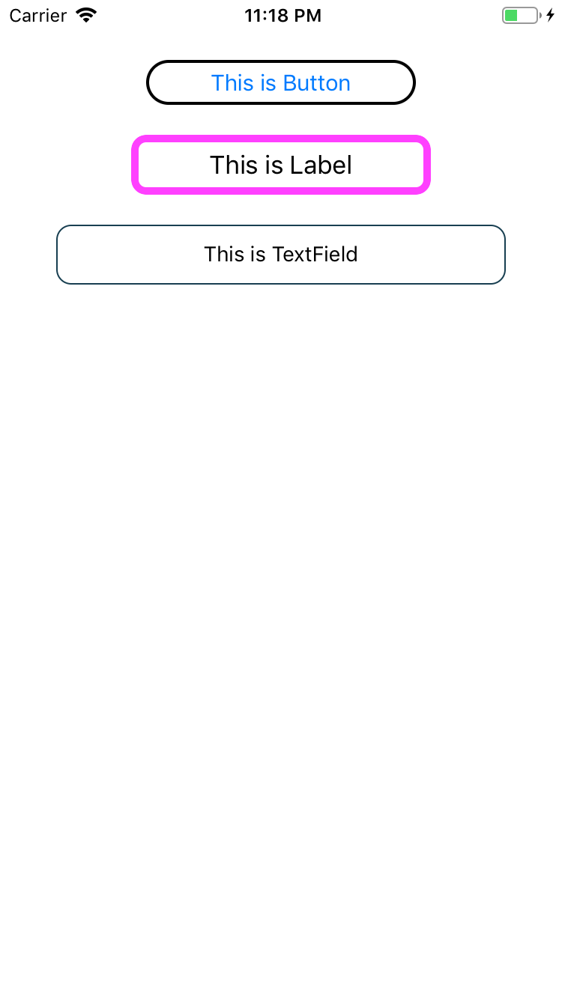
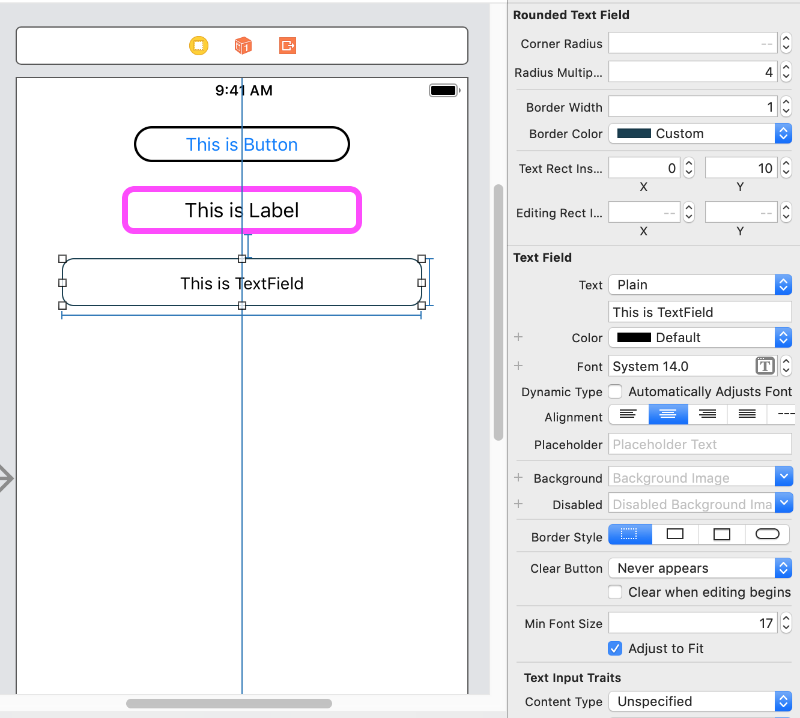

# Rounded

[](https://travis-ci.org/serhii-londar/Rounded)
[](https://cocoapods.org/pods/Rounded)
[](https://cocoapods.org/pods/Rounded)
[](https://cocoapods.org/pods/Rounded)

Small Swift library which contains subclasses for standard iOS controls with a possibility to add rounded corners and borders.

## Example

To run the example project, clone the repo, and run `pod install` from the Example directory first.

## Requirements


## Installation

Rounded is available through [CocoaPods](https://cocoapods.org). To install
it, simply add the following line to your Podfile:

```ruby
pod 'Rounded', :git => 'https://github.com/serhii-londar/Rounded.git'
```

## Screenshots


<p align="center">

</p>


<p align="center">

</p>


## Author

serhii-londar, serhii.londar@gmail.com

## License

Rounded is available under the MIT license. See the LICENSE file for more info.
